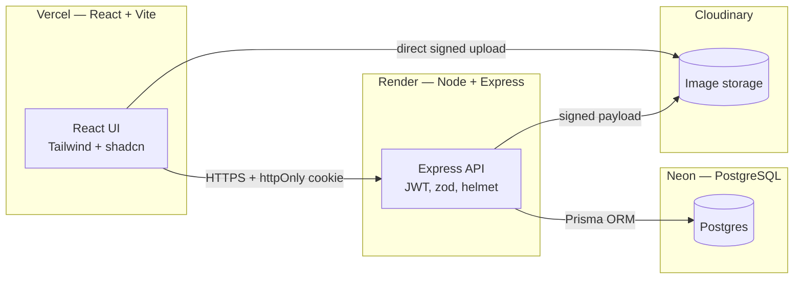

# Architecture

```mermaid
flowchart LR
  subgraph Client [Vercel — React + Vite]
    UI[React UI<br/>Tailwind + shadcn]
  end
  subgraph Server [Render — Node + Express]
    API[Express API<br/>JWT, zod, helmet]
  end
  subgraph DB [Neon — PostgreSQL]
    PG[(Postgres)]
  end
  subgraph Files [Cloudinary]
    Cloud[(Image storage)]
  end

  UI -- HTTPS + httpOnly cookie --> API
  UI -- direct signed upload --> Cloud
  API -- Prisma ORM --> PG
  API -- signed payload --> Cloud
```
