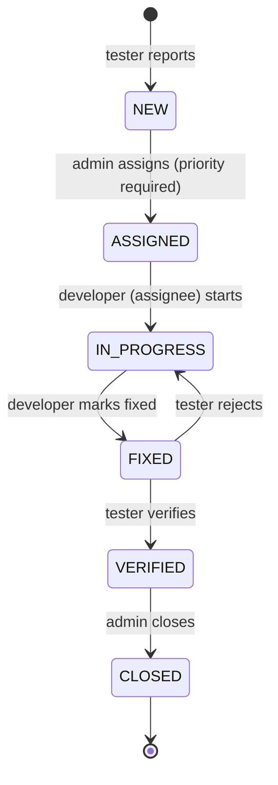

# Bug lifecycle

```mermaid
stateDiagram-v2
  [*] --> NEW: tester reports
  NEW --> ASSIGNED: admin assigns (priority required)
  ASSIGNED --> IN_PROGRESS: developer (assignee) starts
  IN_PROGRESS --> FIXED: developer marks fixed
  FIXED --> VERIFIED: tester verifies
  FIXED --> IN_PROGRESS: tester rejects
  VERIFIED --> CLOSED: admin closes
  CLOSED --> [*]
```
